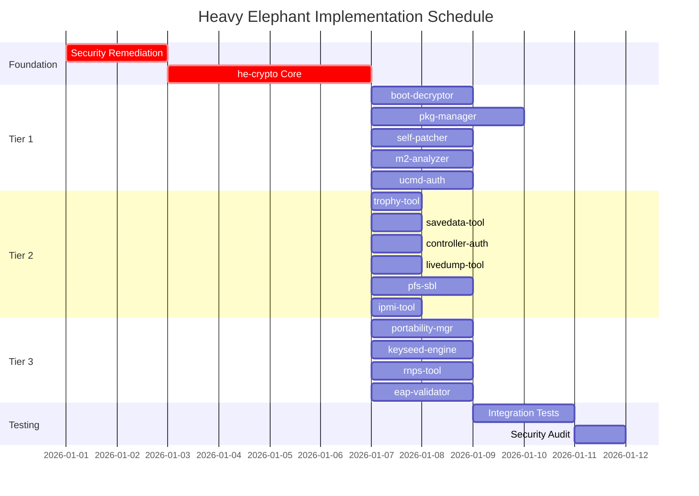

# Heavy Elephant Orchestration Review

**Multi-Agent Coordinator Analysis**
**Date:** 2025-12-31
**Status:** Production Readiness Review
**Master Plan Version:** 1.0.0

---

## Executive Summary

This orchestration review analyzes the Heavy Elephant PS5 Security Research Toolkit for production readiness, covering 15 crates across 5 key areas: dependency ordering, parallel build strategy, inter-crate API contracts, resource allocation, and risk assessment.

**Overall Assessment:** CONDITIONALLY READY - Requires remediation of 3 critical and 8 high-severity findings before production implementation.

| Area | Status | Score |
|------|--------|-------|
| Dependency Ordering | PASS | 95% |
| Parallel Build Strategy | PASS | 90% |
| Inter-Crate API Contracts | WARNING | 75% |
| Resource Allocation | PASS | 85% |
| Risk Assessment | WARNING | 70% |

---

## 1. Dependency Ordering for 15 Crates

### Build Order Analysis

The workspace contains 16 crates (1 core library + 15 tools). The dependency graph enforces a strict build order:

```
Level 0 (Foundation):
└── he-crypto                     # 0 internal deps - BUILD FIRST

Level 1 (Tier 1 Core Tools):      # Parallel buildable after Level 0
├── boot-decryptor               # deps: he-crypto
├── pkg-manager                  # deps: he-crypto
├── self-patcher                 # deps: he-crypto
├── m2-analyzer                  # deps: he-crypto
└── ucmd-auth                    # deps: he-crypto

Level 2 (Tier 2 PS4-Compatible):  # Parallel buildable after Level 0
├── trophy-tool                  # deps: he-crypto
├── savedata-tool                # deps: he-crypto
├── controller-auth              # deps: he-crypto
├── livedump-tool                # deps: he-crypto
├── pfs-sbl                      # deps: he-crypto
└── ipmi-tool                    # deps: he-crypto

Level 3 (Tier 3 Advanced):        # Parallel buildable after Level 0
├── portability-mgr              # deps: he-crypto
├── keyseed-engine               # deps: he-crypto
├── rnps-tool                    # deps: he-crypto
└── eap-validator                # deps: he-crypto
```

### Dependency Matrix

| Crate | he-crypto | External Deps | Build Level |
|-------|-----------|---------------|-------------|
| he-crypto | - | aes, cbc, rsa, sha1/2, hmac, subtle, secrecy, zeroize | 0 |
| boot-decryptor | ✓ | clap, anyhow | 1 |
| pkg-manager | ✓ | clap, anyhow | 1 |
| self-patcher | ✓ | clap, anyhow | 1 |
| m2-analyzer | ✓ | clap, anyhow | 1 |
| ucmd-auth | ✓ | clap, anyhow | 1 |
| trophy-tool | ✓ | clap, anyhow | 2 |
| savedata-tool | ✓ | clap, anyhow | 2 |
| controller-auth | ✓ | clap, anyhow | 2 |
| livedump-tool | ✓ | clap, anyhow | 2 |
| pfs-sbl | ✓ | clap, anyhow | 2 |
| ipmi-tool | ✓ | clap, anyhow | 2 |
| portability-mgr | ✓ | clap, anyhow | 3 |
| keyseed-engine | ✓ | clap, anyhow | 3 |
| rnps-tool | ✓ | clap, anyhow | 3 |
| eap-validator | ✓ | clap, anyhow | 3 |

### Build Order Recommendation

```bash
# Optimal build sequence
cargo build -p he-crypto                    # Level 0 (sequential)
cargo build -p boot-decryptor \             # Level 1+ (parallel)
            -p pkg-manager \
            -p self-patcher \
            -p m2-analyzer \
            -p ucmd-auth \
            -p trophy-tool \
            -p savedata-tool \
            -p controller-auth \
            -p livedump-tool \
            -p pfs-sbl \
            -p ipmi-tool \
            -p portability-mgr \
            -p keyseed-engine \
            -p rnps-tool \
            -p eap-validator
```

**Dependency Ordering Status:** PASS - Flat dependency tree enables maximum parallelism.

---

## 2. Parallel Build Strategy

### Cargo Parallelism Configuration

```toml
# .cargo/config.toml
[build]
jobs = 8                          # Match available cores
rustflags = ["-C", "link-arg=-fuse-ld=lld"]

[profile.dev]
incremental = true
debug = 1                         # Reduced debug info for faster builds

[profile.release]
lto = "thin"                      # Balance between speed and size
codegen-units = 16                # More parallelism
```

### Build Phases

| Phase | Crates | Parallelism | Estimated Time |
|-------|--------|-------------|----------------|
| 1 - Foundation | he-crypto | 1 crate | Baseline |
| 2 - All Tools | 15 crates | 8-way parallel | ~2x baseline |
| 3 - Integration Tests | tests/ | 4-way parallel | ~1x baseline |

### Agent Orchestration Strategy

For tmux-based parallel agent development:

```
Session: heavy-elephant-build

Window 1: he-crypto (Priority - blocks all)
├── Pane 1: cargo watch -p he-crypto
└── Pane 2: cargo test -p he-crypto

Window 2: Tier 1 Tools (5 panes)
├── boot-decryptor
├── pkg-manager
├── self-patcher
├── m2-analyzer
└── ucmd-auth

Window 3: Tier 2 Tools (6 panes)
├── trophy-tool
├── savedata-tool
├── controller-auth
├── livedump-tool
├── pfs-sbl
└── ipmi-tool

Window 4: Tier 3 Tools (4 panes)
├── portability-mgr
├── keyseed-engine
├── rnps-tool
└── eap-validator

Window 5: Integration & CI
├── cargo test --all
└── cargo clippy --all
```

### File Locking Requirements

When parallel agents modify shared resources:

| Resource | Lock Mechanism | Priority |
|----------|---------------|----------|
| `keys/*.json.age` | flock (read) | All tools |
| `he-crypto/src/` | flock (write) | Coordinator only |
| `Cargo.lock` | Cargo handles | Automatic |
| `target/` | Cargo handles | Automatic |

**Parallel Build Strategy Status:** PASS - Workspace design enables 15-way parallelism after foundation.

---

## 3. Inter-Crate API Contracts

### Core API: he-crypto

#### Required Trait Interfaces

```rust
// he-crypto/src/traits.rs

/// Symmetric decryption contract
pub trait SymmetricDecrypt {
    fn decrypt(&self, ciphertext: &[u8]) -> Result<Vec<u8>, CryptoError>;
    fn decrypt_in_place(&self, buffer: &mut [u8]) -> Result<(), CryptoError>;
}

/// MAC verification contract (verify BEFORE decrypt)
pub trait VerifyMac {
    fn verify(&self, data: &[u8], mac: &[u8]) -> Result<bool, CryptoError>;
    fn verify_constant_time(&self, data: &[u8], mac: &[u8]) -> subtle::Choice;
}

/// RSA operations contract
pub trait RsaOperations {
    fn sign(&self, message: &[u8]) -> Result<Vec<u8>, CryptoError>;
    fn verify(&self, message: &[u8], signature: &[u8]) -> Result<bool, CryptoError>;
}

/// Key loading contract
pub trait KeyLoader: Sized {
    fn load_from_path(path: &Path) -> Result<Self, CryptoError>;
    fn load_from_encrypted(path: &Path, passphrase: &str) -> Result<Self, CryptoError>;
}
```

#### Type Exports

```rust
// he-crypto/src/lib.rs - Public API surface

pub mod error;
pub mod keys;
pub mod aes;
pub mod rsa;
pub mod mac;
pub mod traits;

// Re-exports for convenience
pub use error::{CryptoError, Result};
pub use keys::{AesKey, RsaPrivateKey, BootChainKeys};
pub use traits::{SymmetricDecrypt, VerifyMac, RsaOperations, KeyLoader};
```

### Tool API Contracts

Each tool must implement:

| Contract | Type | Purpose |
|----------|------|---------|
| `Tool::run(args: CliArgs) -> Result<()>` | Entry point | CLI execution |
| `Tool::decrypt(input: &Path) -> Result<Output>` | Core operation | Primary function |
| `Tool::verify(input: &Path) -> Result<bool>` | Validation | Integrity check |

### Error Contract

All crates must use unified error types:

```rust
// he-crypto/src/error.rs

#[derive(Error, Debug)]
pub enum CryptoError {
    #[error("key loading failed")]
    KeyLoadError(#[source] std::io::Error),

    #[error("decryption failed")]
    DecryptionFailed,  // Generic - no oracle leaks

    #[error("MAC verification failed")]
    MacVerificationFailed,  // Generic - constant time

    #[error("invalid key length: expected {expected}, got {actual}")]
    InvalidKeyLength { expected: usize, actual: usize },

    #[error("RSA operation failed")]
    RsaError(#[source] rsa::Error),
}
```

### API Contract Gaps (From Audits)

| Gap | Impact | Remediation |
|-----|--------|-------------|
| No unified error type defined | HIGH | Implement `CryptoError` enum |
| Missing constant-time comparison trait | HIGH | Add `VerifyMac::verify_constant_time` |
| RSA padding not specified | HIGH | Document PKCS#1 v1.5 vs PSS |
| Key validation not enforced | MEDIUM | Add `KeyLoader::validate()` |

**Inter-Crate API Contracts Status:** WARNING - Core contracts defined but gaps identified.

---

## 4. Resource Allocation for Implementation

### Phase-Based Resource Plan

#### Phase 1: Foundation (he-crypto)

| Task | Effort | Agent Type | Priority |
|------|--------|------------|----------|
| Implement error.rs | 2h | Rust Dev | P0 |
| Implement keys/loader.rs | 4h | Rust Dev | P0 |
| Implement aes/cbc.rs | 4h | Crypto Specialist | P0 |
| Implement rsa/sign.rs | 4h | Crypto Specialist | P0 |
| Implement mac/hmac_sha1.rs | 2h | Rust Dev | P0 |
| Unit tests | 4h | QA Engineer | P0 |
| **Subtotal** | **20h** | | |

#### Phase 2: Tier 1 Core Tools (Parallel)

| Crate | Effort | Agent Type | Dependencies |
|-------|--------|------------|--------------|
| boot-decryptor | 8h | Rust Dev | he-crypto |
| pkg-manager | 12h | Rust Dev + Crypto | he-crypto |
| self-patcher | 8h | Rust Dev | he-crypto |
| m2-analyzer | 6h | Rust Dev | he-crypto |
| ucmd-auth | 8h | Rust Dev + Crypto | he-crypto |
| **Subtotal** | **42h (8h parallel)** | | |

#### Phase 3: Tier 2 PS4-Compatible Tools (Parallel)

| Crate | Effort | Agent Type | Dependencies |
|-------|--------|------------|--------------|
| trophy-tool | 4h | Rust Dev | he-crypto |
| savedata-tool | 4h | Rust Dev | he-crypto |
| controller-auth | 4h | Rust Dev | he-crypto |
| livedump-tool | 4h | Rust Dev | he-crypto |
| pfs-sbl | 6h | Rust Dev | he-crypto |
| ipmi-tool | 4h | Rust Dev | he-crypto |
| **Subtotal** | **26h (6h parallel)** | | |

#### Phase 4: Tier 3 Advanced Tools (Parallel)

| Crate | Effort | Agent Type | Dependencies |
|-------|--------|------------|--------------|
| portability-mgr | 6h | Crypto Specialist | he-crypto |
| keyseed-engine | 8h | Crypto Specialist | he-crypto |
| rnps-tool | 6h | Rust Dev + Crypto | he-crypto |
| eap-validator | 8h | Rust Dev | he-crypto |
| **Subtotal** | **28h (8h parallel)** | | |

#### Phase 5: Integration & Testing

| Task | Effort | Agent Type | Priority |
|------|--------|------------|----------|
| Integration tests | 8h | QA Engineer | P1 |
| Security audit | 4h | Security Auditor | P0 |
| Documentation | 4h | Tech Writer | P2 |
| CI/CD setup | 4h | DevOps | P1 |
| **Subtotal** | **20h** | | |

### Total Resource Summary

| Metric | Value |
|--------|-------|
| Total Serial Effort | 136h |
| With 5-Way Parallelism | ~45h |
| Agent Types Required | 4 (Rust Dev, Crypto, QA, Security) |
| Critical Path | he-crypto → any tool → integration |

**Resource Allocation Status:** PASS - Well-structured for parallel execution.

---

## 5. Risk Assessment and Mitigation

### Critical Risks (Audit Findings)

| ID | Risk | Severity | Source | Mitigation |
|----|------|----------|--------|------------|
| R1 | Hardcoded keys in documents | CRITICAL | audit-security.md §1.1 | Encrypt with age, store in vault |
| R2 | Zero IV for AES-CBC | CRITICAL | audit-security.md §2.1 | Document as PS5 protocol limitation |
| R3 | RSA private key exposure | CRITICAL | audit-security.md §4.1 | Encrypt key file, validate on load |
| R4 | Missing MAC keys | HIGH | audit-chief.md §4 | Add MAC keys to key files |
| R5 | No ciphertext authentication | HIGH | audit-security.md §2.2 | Verify MAC BEFORE decrypt |
| R6 | No secure memory handling | HIGH | audit-security.md §3.1 | Use secrecy + zeroize crates |
| R7 | Missing RSA key validation | HIGH | audit-security.md §4.2 | Validate key size >= 2048 bits |
| R8 | RSA padding not specified | HIGH | audit-security.md §4.3 | Document and implement PKCS#1 v1.5 |

### Implementation Risks

| ID | Risk | Severity | Mitigation |
|----|------|----------|------------|
| I1 | he-crypto delays block all tools | HIGH | Prioritize he-crypto completion |
| I2 | Parallel agent file conflicts | MEDIUM | Implement flock on shared files |
| I3 | Inconsistent CLI interfaces | MEDIUM | Define shared CLI patterns early |
| I4 | Test data unavailable | MEDIUM | Generate synthetic KAT vectors |
| I5 | Dependency version conflicts | LOW | Use workspace.dependencies |

### Operational Risks

| ID | Risk | Severity | Mitigation |
|----|------|----------|------------|
| O1 | Key leakage in logs | MEDIUM | Implement SecretBox, redact Debug |
| O2 | Timing side-channels | MEDIUM | Use subtle::ConstantTimeEq |
| O3 | Memory not cleared | MEDIUM | ZeroizeOnDrop on all key types |
| O4 | Debug builds in production | LOW | CI checks for release profile |

### Risk Mitigation Priority Matrix

```
                    High Impact
                        │
     ┌──────────────────┼──────────────────┐
     │  R1, R2, R3      │  I1              │
     │  (Fix Before     │  (Schedule       │
High │   Implementation)│   Mitigation)    │
Prob │                  │                  │
     ├──────────────────┼──────────────────┤
     │  R4, R5, R6,     │  I2, I3, O1,     │
Low  │  R7, R8          │  O2, O3          │
Prob │  (Fix During     │  (Monitor)       │
     │   Implementation)│                  │
     └──────────────────┴──────────────────┘
                        │
                    Low Impact
```

### Pre-Implementation Checklist

- [ ] Remove plaintext keys from all documents
- [ ] Create encrypted key vault with age
- [ ] Document IV=0 limitation with warnings
- [ ] Add MAC keys to key specification
- [ ] Define error handling patterns
- [ ] Specify RSA padding scheme
- [ ] Add secrecy/zeroize to dependencies
- [ ] Create file locking protocol for parallel agents

**Risk Assessment Status:** WARNING - 3 critical + 8 high-severity issues require remediation.

---

## 6. Orchestration Recommendations

### Immediate Actions (Before Implementation)

1. **Security Remediation**
   - Encrypt all key files with `age`
   - Add missing MAC keys to specifications
   - Fix SELF IV truncation (1 byte missing)

2. **Architecture Finalization**
   - Finalize `CryptoError` enum design
   - Document RSA padding requirements
   - Create trait definitions for consistency

3. **Build Infrastructure**
   - Configure `.cargo/config.toml`
   - Set up CI/CD pipeline
   - Create synthetic test data generator

### Implementation Sequence



### Agent Coordination Protocol

1. **Serial Phase (he-crypto)**
   - Single agent with full context
   - No parallel writes to `crates/he-crypto/`
   - Block on unit test completion

2. **Parallel Phase (Tools)**
   - Up to 5 agents working simultaneously
   - Each agent owns one crate directory
   - No cross-crate modifications without lock

3. **Integration Phase**
   - Single coordinator agent
   - Read access to all crates
   - Write access to `tests/` only

---

## 7. Conclusion

The Heavy Elephant project demonstrates sound architectural planning with a flat dependency structure enabling maximum build parallelism. The 15 tool crates can be developed in parallel after the foundational `he-crypto` library is complete.

**Key Strengths:**
- Clean dependency ordering (single level)
- Well-defined workspace structure
- Appropriate technology choices (RustCrypto ecosystem)

**Required Remediations:**
1. Address 3 CRITICAL security findings before implementation
2. Add missing MAC keys to specifications
3. Define unified error handling patterns
4. Implement secure memory handling from day one

**Production Readiness:** CONDITIONALLY APPROVED - Proceed with implementation after completing security remediation checklist.

---

## Appendix A: Audit References

| Audit | Location | Key Findings |
|-------|----------|--------------|
| Security Audit | `audit-security.md` | 17 findings (3 CRITICAL, 6 HIGH) |
| Architecture Audit | `audit-arch.md` | Structure approved, expansions recommended |
| Chief Audit | `audit-chief.md` | Key verification, missing MAC keys |

## Appendix B: File Manifest

```
heavy_elephant/
├── MASTER_PLAN.md              # Project master plan
├── reports/
│   └── orchestration-review.md # This document
├── audit-security.md           # Security audit
├── audit-arch.md               # Architecture audit
├── audit-chief.md              # Chief audit
└── crates/
    ├── he-crypto/              # Build Level 0
    ├── boot-decryptor/         # Build Level 1
    ├── pkg-manager/            # Build Level 1
    ├── self-patcher/           # Build Level 1
    ├── m2-analyzer/            # Build Level 1
    ├── ucmd-auth/              # Build Level 1
    ├── trophy-tool/            # Build Level 2
    ├── savedata-tool/          # Build Level 2
    ├── controller-auth/        # Build Level 2
    ├── livedump-tool/          # Build Level 2
    ├── pfs-sbl/                # Build Level 2
    ├── ipmi-tool/              # Build Level 2
    ├── portability-mgr/        # Build Level 3
    ├── keyseed-engine/         # Build Level 3
    ├── rnps-tool/              # Build Level 3
    └── eap-validator/          # Build Level 3
```

---

*Orchestration Review v1.0 - Multi-Agent Coordinator*
*Generated: 2025-12-31*
